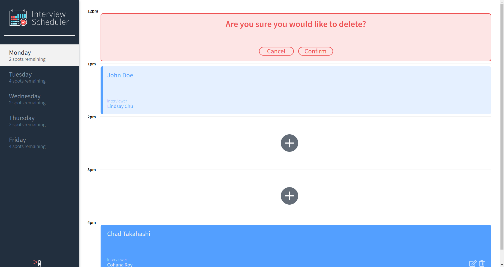

# Interview Scheduler

## Setup

Install dependencies with `npm install`.
must use together with scheduler-api

## Running Webpack Development Server

```sh
npm start
```

## Running Jest Test Framework

```sh
npm test
```

## Running Storybook Visual Testbed

```sh
npm run storybook
```
## Running Cypress
After Webpack is lauched using npm start
```sh
npm run cypress
```


